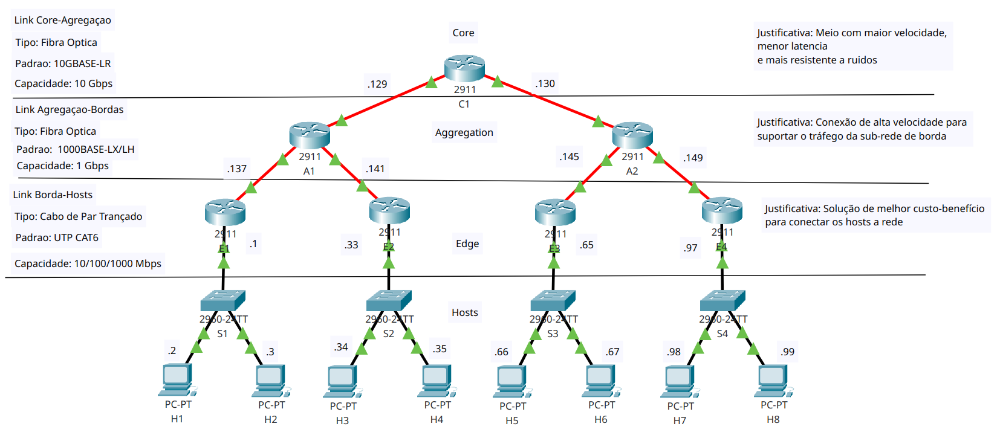

# Trabalho 2 - Redes de Computadores

## Autores

* **Angel Flavius Alves Negri** - Matrícula: 241038110
* **Matheus De Melo Fellet** - Matrícula: 222015201
* **Matheus Duarte Da Silva** - Matrícula: 211062277

## Visão Geral

Este trabalho apresenta o projeto e a implementação completa de uma rede com topologia em árvore hierárquica (Core, Agregação e Borda). A primeira fase do projeto consistiu no planejamento da rede, incluindo o cálculo de sub-redes com **VLSM (Variable Length Subnet Mask)** para otimização do espaço de IPs e a definição manual de **tabelas de roteamento estático** para todos os roteadores.

A segunda fase focou na simulação dessa topologia em **Python**, utilizando a biblioteca **NetworkX** para modelar a rede como um grafo. Foram implementados os comandos `xping` e `xtraceroute` para validar a conectividade e analisar os caminhos dos pacotes entre os hosts da rede.

## Topologia da Rede

O diagrama abaixo, criado no Cisco Packet Tracer, representa a arquitetura final da rede, incluindo a documentação dos enlaces, IPs e camadas hierárquicas.



## Principais Características

* **Planejamento com VLSM:** Alocação eficiente de endereços IP para sub-redes de tamanhos variados, atendendo aos requisitos de 30 e 20 hosts.
* **Roteamento Estático:** Configuração manual e completa das tabelas de roteamento em todos os 7 roteadores, garantindo comunicação total na rede.
* **Simulação em Python:** Uso da biblioteca NetworkX para criar um modelo funcional da rede, com nós representando dispositivos e arestas representando os enlaces.
* **Comandos de Diagnóstico:** Implementação dos comandos `xping` e `xtraceroute` para simular testes de conectividade e rastreamento de rota.
* **Interface de Linha de Comando (CLI):** Um menu interativo (`main.py`) que permite ao usuário escolher hosts de origem e destino para realizar os testes.

## Tecnologias Utilizadas

* **Linguagem:** Python 3.13
* **Bibliotecas:** NetworkX, OS, Time
* **Software de Simulação:** Cisco Packet Tracer 8.2

## Como Executar a Simulação

Para executar o simulador de rede em seu ambiente local, siga os passos abaixo.

**1. Clone o repositório:**

```sh
git clone https://github.com/smmstakes/redes-trabalho-2.git
cd redes-trabalho-2
```

**2. Instale as dependências:**

```sh
pip install -r requirements.txt
```

**3. Execute o programa principal:**
O arquivo `main.py` contém a interface interativa.

```sh
python main.py
```

Após executar, siga as instruções no terminal para escolher os hosts de origem e destino e ver os resultados dos testes `xping` e `xtraceroute`.

## Detalhes Técnicos do Planejamento

### Tabela de Alocação VLSM

| Uso da Sub-rede           | Endereço de Rede | Máscara | Faixa de IPs Úteis           | Broadcast      |
| ------------------------- | ---------------- | ------- | ---------------------------- | -------------- |
| **Rede para Hosts de e1** | `192.168.0.0`    | `/27`   | `192.168.0.1` - `192.168.0.30`   | `192.168.0.31` |
| **Rede para Hosts de e2** | `192.168.0.32`   | `/27`   | `192.168.0.33` - `192.168.0.62`  | `192.168.0.63` |
| **Rede para Hosts de e3** | `192.168.0.64`   | `/27`   | `192.168.0.65` - `192.168.0.94`  | `192.168.0.95` |
| **Rede para Hosts de e4** | `192.168.0.96`   | `/27`   | `192.168.0.97` - `192.168.0.126` | `192.168.0.127`|
| **Enlace C1-A1** | `192.168.0.128`  | `/30`   | `.129`, `.130`               | `.131`         |
| **Enlace C1-A2** | `192.168.0.132`  | `/30`   | `.133`, `.134`               | `.135`         |
| **Enlace A1-E1** | `192.168.0.136`  | `/30`   | `.137`, `.138`               | `.139`         |
| **Enlace A1-E2** | `192.168.0.140`  | `/30`   | `.141`, `.142`               | `.143`         |
| **Enlace A2-E3** | `192.168.0.144`  | `/30`   | `.145`, `.146`               | `.147`         |
| **Enlace A2-E4** | `192.168.0.148`  | `/30`   | `.149`, `.150`               | `.151`         |


### Especificações dos Enlaces

| Tipo de Enlace  | Meio Físico   | Padrão       | Capacidade | Justificativa                                     |
| --------------- | ------------- | ------------ | ---------- | ------------------------------------------------- |
| Core-Agregação  | Fibra Óptica  | 10GBASE-LR   | 10 Gbps    | Suportar o alto tráfego agregado de múltiplas sub-redes. |
| Agregação-Borda | Fibra Óptica  | 1000BASE-LX  | 1 Gbps     | Balanceamento ideal entre custo e desempenho.     |
| Borda-Hosts     | Par Trançado  | UTP CAT6     | 100 Mbps     | Melhor custo-benefício para acesso dos hosts.     |

---